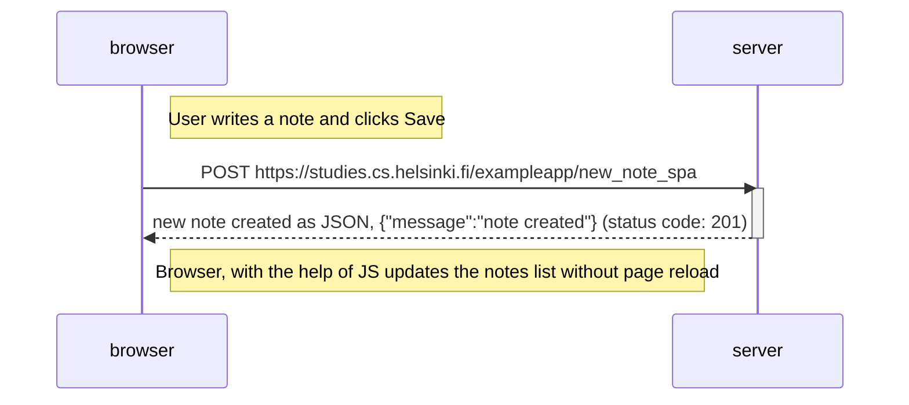

```mermaid
sequenceDiagram
    participant browser
    participant server

    Note right of browser: User writes a note and clicks Save

    browser->>server:   POST https://studies.cs.helsinki.fi/exampleapp/new_note_spa
    activate server
    server-->>browser: new note created as JSON, {"message":"note created"} (status code: 201)
    deactivate server

    Note right of browser: Browser, with the help of JS updates the notes list without page reload


```
